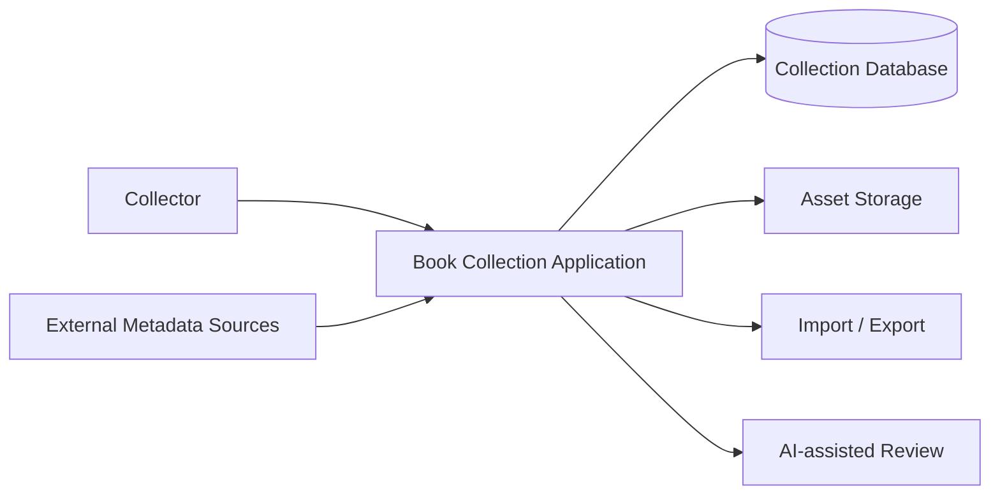
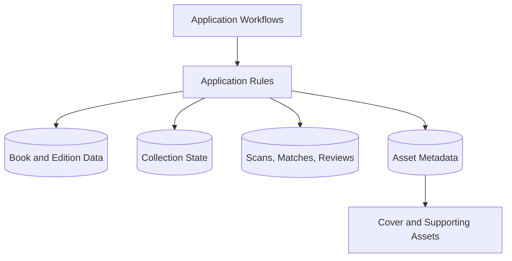
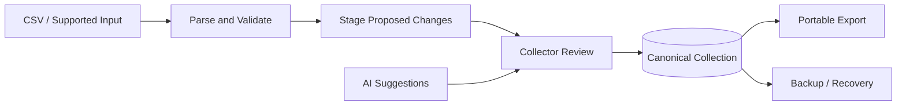
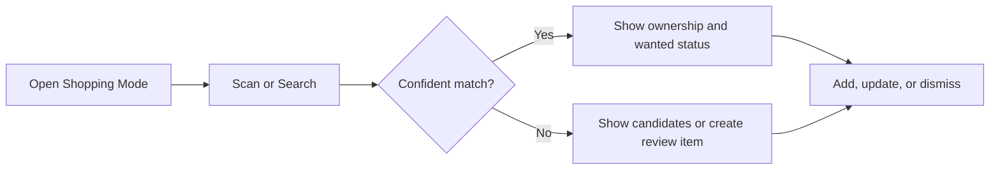
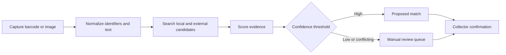
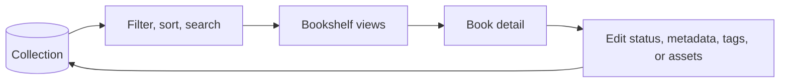

# Architecture

This document defines system boundaries and information flow. Technology choices and deployed topology must be reconciled with the actual ChatGPT Site implementation workspace and saved/deployed Site state.

## System context

## Application responsibilities

- Present shopping, scanning, bookshelf, and review workflows.
- Apply validation and collection rules consistently.
- Keep canonical data separate from suggestions and external metadata.
- Expose provenance and confidence when data is uncertain.

## Data and asset boundaries

The diagram shows logical responsibilities, not verified table names or deployment units. See [Database](DATABASE.md) and [Asset Management](ASSET_MANAGEMENT.md).

## Import, export, and review

Imports and AI output must not bypass validation and review when changes are ambiguous or destructive.

## Shopping workflow

## Scanner workflow

## Bookshelf workflow

## Cross-cutting rules

- Canonical collection state has a single authoritative owner.
- Suggestions retain source, timestamp, and confidence where applicable.
- External metadata and reference covers are replaceable enrichment.
- Imports are repeatable and report validation failures.
- Exports are documented and usable without the application.
- Destructive or ambiguous changes require explicit confirmation.

## Portability constraint

ChatGPT Sites is the current deployment environment, not the permanent boundary of the application architecture. Preserve a reasonable future path to PWA packaging, Android/iOS packaging, self-hosted web deployment, and alternative front ends such as Power Apps without implementing or separately roadmapping those targets now.

Prefer:

- Explicit APIs between user interfaces and persistence.
- Portable schema migrations and standard JSON data contracts.
- Platform-specific authentication isolated behind a narrow boundary.
- Replaceable database and object-storage adapters where practical.
- Business rules outside platform-specific UI or deployment components.
- Responsive, mobile-first interfaces and browser-compatible camera/scanning behavior where practical.

Avoid:

- Critical business logic embedded in Sites deployment behavior.
- Undocumented platform behavior as the only data-preservation mechanism.
- Direct UI coupling to D1/R2 where an API boundary is practical.
- Data formats that only one runtime can interpret.

Apply this constraint proportionately. It guides boundaries and tradeoffs in current work but does not authorize speculative abstractions, new platform implementations, or broader milestone scope.

## Sites-native migration bridge

The implemented temporary bridge follows [ADR-0009](decisions/ADR-0009-sites-native-migration-bridge.md):

- Ordinary Books, Collections, and cover paths use Version 16-compatible schema access until explicit upgrade completion.
- Owner-only HTTP/JSON APIs separate schema status, structured export, explicit upgrade, and verification from UI, startup, `ensureSeeded()`, and ordinary traffic.
- Sites authentication is isolated at the authorization boundary; testable server modules own reconciliation and export rules.
- Reconciliation inspects before additive changes, supports repeat and partial-state recovery, and verifies preservation before completion.
- Duplicate invocation protection is process-local, not a distributed lock; the private single-owner workflow must serialize production invocation.
- Schema inspection is durable truth because runtime phase/error memory can reset.
- Versioned JSON export contains structured records and R2 references but is not a database snapshot, R2-byte backup, or restore mechanism.

### Verified authentication and invocation paths

- Normal owner mutations and bridge administration routes use the same server-side owner authorization helper in the same Site worker.
- Sites-forwarded identity is checked against the configured owner identity on every protected server request; client-side owner-mode controls are advisory only.
- Normal UI operations use same-origin browser requests. D1 access is acquired server-side through the managed binding; cover operations also use the managed R2 binding.
- The failed Engineer preflight attempts ended before application route execution. They do not establish an authorization-helper, routing, or binding failure, and direct Engineer invocation is not a proven operational path.
- A narrow permanent owner-authenticated in-Site administration surface is accepted to reuse the proven same-origin path while leaving bridge business logic in server modules. It is not an authentication bypass and must not expose credentials, session material, or impersonation capability to Engineer. Any schema-changing action requires deliberate confirmation and same-origin/CSRF protection and remains separately authorized. See [ADR-0010](decisions/ADR-0010-owner-authenticated-administration-surface.md).

The surface was saved and published as Site Version 19. Gate 2 used its owner-authenticated same-origin path to observe the expected pre-upgrade baseline and retain a private structured export. Gate 3 later invoked its guarded activation exactly once; the immediate response reported Shopping schema completion with zero foreign-key issues, but Gate 4 verification remains unperformed and separately gated. The surface stages status before export/upgrade, withholds controls and data from non-owners, validates private export structure before browser download, and keeps raw records out of rendered feedback. The schema-changing POST adds server-enforced same-origin, JSON content-type, dedicated action-header, and exact confirmation checks before migration logic. Client locking reduces accidental duplicate submission; server authorization and durable schema inspection remain authoritative.
