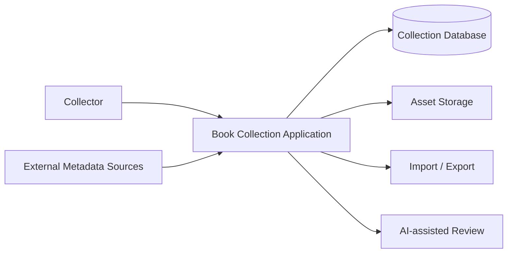
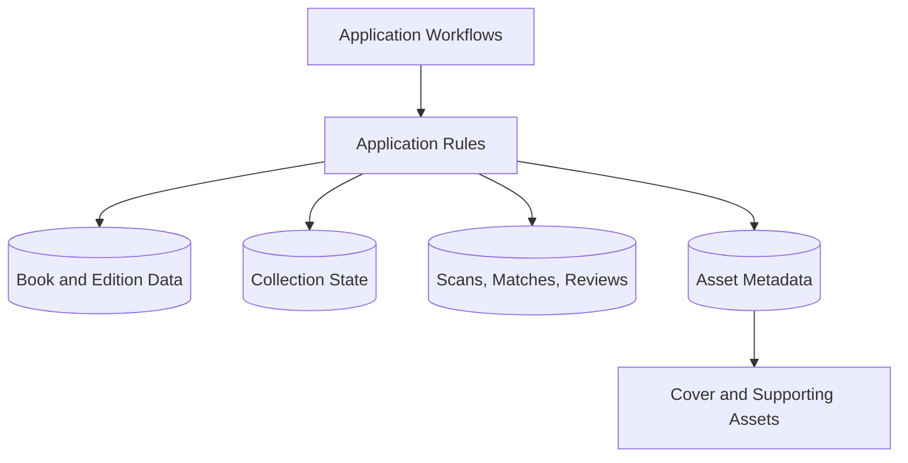
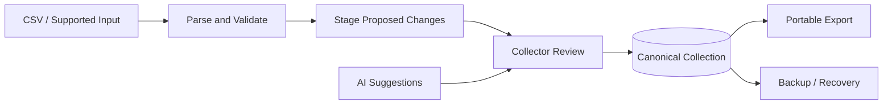
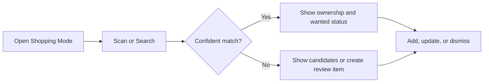
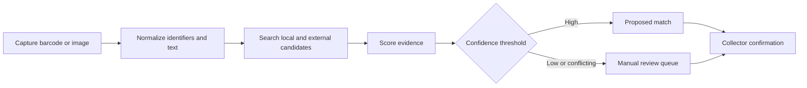
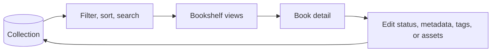

# Architecture

This document defines system boundaries and information flow. Technology choices and deployed topology must be reconciled with the implementation repository during the database review.

## System context

## Application responsibilities

- Present shopping, scanning, bookshelf, and review workflows.
- Apply validation and collection rules consistently.
- Keep canonical data separate from suggestions and external metadata.
- Expose provenance and confidence when data is uncertain.

## Data and asset boundaries

The diagram shows logical responsibilities, not verified table names or deployment units. See [Database](DATABASE.md) and [Asset Management](ASSET_MANAGEMENT.md).

## Import, export, and review

Imports and AI output must not bypass validation and review when changes are ambiguous or destructive.

## Shopping workflow

## Scanner workflow

## Bookshelf workflow

## Cross-cutting rules

- Canonical collection state has a single authoritative owner.
- Suggestions retain source, timestamp, and confidence where applicable.
- External metadata and reference covers are replaceable enrichment.
- Imports are repeatable and report validation failures.
- Exports are documented and usable without the application.
- Destructive or ambiguous changes require explicit confirmation.

## Portability constraint

ChatGPT Sites is the current deployment environment, not the permanent boundary of the application architecture. Preserve a reasonable future path to PWA packaging, Android/iOS packaging, self-hosted web deployment, and alternative front ends such as Power Apps without implementing or separately roadmapping those targets now.

Prefer:

- Explicit APIs between user interfaces and persistence.
- Portable schema migrations and standard JSON data contracts.
- Platform-specific authentication isolated behind a narrow boundary.
- Replaceable database and object-storage adapters where practical.
- Business rules outside platform-specific UI or deployment components.
- Responsive, mobile-first interfaces and browser-compatible camera/scanning behavior where practical.

Avoid:

- Critical business logic embedded in Sites deployment behavior.
- Undocumented platform behavior as the only data-preservation mechanism.
- Direct UI coupling to D1/R2 where an API boundary is practical.
- Data formats that only one runtime can interpret.

Apply this constraint proportionately. It guides boundaries and tradeoffs in current work but does not authorize speculative abstractions, new platform implementations, or broader milestone scope.
