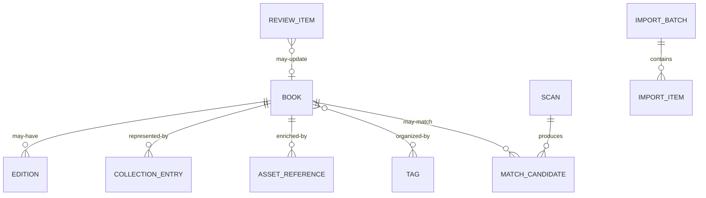

# Database

This document records responsibilities and open design questions only. It does not authorize schema changes.

## Current

### Verified inventory

The production schema has not yet been supplied to this repository. Table names, keys, constraints, and migrations must be copied from or linked to the implementation repository during Priority 0 database review.

| Area to verify | Expected responsibility | Evidence required |
| --- | --- | --- |
| Book identity | Work-level title and creator identity | Current tables, keys, and duplicate rules |
| Edition identity | ISBN and edition-specific metadata | Identifier constraints and book relationship |
| Collection state | Owned, wanted, and collector-specific state | Status model and history behavior |
| Scan and match | Captures, candidates, scores, and decisions | Persistence and retention rules |
| Assets | Cover references, provenance, and lifecycle | Storage ownership and fallback behavior |
| Tags | Collector-defined labels and assignments | Uniqueness and deletion behavior |
| Import and review | Batches, errors, suggestions, and approvals | Audit and rollback behavior |

Until verified, these are responsibility areas—not claims about existing tables.

## Relationship overview

This is a proposed conceptual model. It deliberately does not prescribe physical tables.

## Expected responsibilities

- Preserve stable identity separately from mutable enrichment.
- Represent collector state without conflating it with bibliographic facts.
- Enforce identifier and relationship integrity where evidence is strong.
- Retain provenance for imported, matched, generated, and manually entered values.
- Support review queues without making suggestions canonical prematurely.
- Enable complete, versioned export and practical recovery.

## Known questions

- What is the current distinction between a book/work and an edition?
- Which entity owns collection status and quantity?
- Can multiple copies or editions be represented?
- How are duplicate ISBNs, missing ISBNs, and conflicting identifiers handled?
- Are match candidates and confidence retained after confirmation?
- Where are asset provenance and reference-cover URLs stored?
- What import operations are idempotent, auditable, or reversible?
- Which deletions cascade, soft-delete, or require retention?
- What backup, restore, and migration guarantees exist?

## Proposed

Future migrations may:

- Clarify work, edition, copy, and collection-state boundaries.
- Add explicit provenance and confidence metadata.
- Introduce staged import and review records.
- Normalize asset references and lifecycle state.
- Add durable identifiers and constraints before expanding automation.

Any proposal requires a verified current-schema assessment, migration plan, rollback plan, and ADR before implementation.
