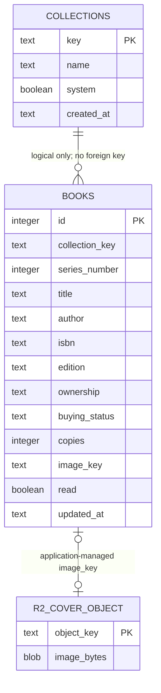

# Database

This document distinguishes verified production behavior, verified local implementation, accepted direction, and future ideas. It does not authorize production schema changes.

## Verified Production State

### Persistence

- Cloudflare D1 stores structured records.
- Cloudflare R2 stores cover image bytes.
- `localStorage` stores interface preferences only.
- Drizzle defines the schema; SQL migrations manage changes.
- The books API performs request-time schema and seed checks.

### Current tables

| Store | Table/object | Primary key | Current responsibilities |
| --- | --- | --- | --- |
| D1 | `books` | `id INTEGER PRIMARY KEY AUTOINCREMENT` | Collection membership, series number, title, author, classification, ownership, buying status, aggregate copies, edition, one ISBN, notes, guidance, one image key, read state, updated timestamp |
| D1 | `collections` | `key TEXT PRIMARY KEY` | Name, system/custom marker, created timestamp |
| R2 | Cover object | Object key | Image bytes referenced by `books.image_key` |

`books` has indexes on `collection_type` and `collection_key`, plus a unique constraint on `(collection_key, collection_type, series_number)`. Collections have no settings fields.

### Current relationships



There are no declared foreign keys. In particular, `books.collection_key` is not enforced against `collections.key`; route code currently carries collection-deletion safety.

### Current missing tables

- Purchases
- Businesses
- Book identifiers
- Book aliases or relationships
- Asset metadata
- Tags and book-tag assignments
- Review batches and proposals
- Collection settings
- Import/export history

### Primary key strategy

- Preserve the stable internal numeric `books.id` values.
- Preserve `collections.key`; it is generated once, survives rename, and remains the collection identifier.
- Current auto-increment book IDs are not portable across independent databases, so safe interchange still lacks an immutable external identifier.

### Foreign key status

No relationships are enforced by D1. The first required foreign key is:

```text
books.collection_key -> collections.key
```

Adding it requires an orphan audit, backup, controlled SQLite table rebuild, and verification that every existing book and collection identifier is unchanged.

### Mixed responsibilities

| Location | Problem |
| --- | --- |
| `books` | Combines catalog identity, bibliographic/edition data, collection state, copies, shopping, reading, guidance, notes, and cover association |
| `collections` | Not overloaded, but lacks collection-level settings such as target price and cover policy |
| `books.image_key` | Cannot distinguish personal/reference assets, variants, attribution, superseded images, or orphans |
| `books.collection_type` | Mixes classification with special-case behavior and should not become general workflow state |

The first responsibilities to move out of `books` are purchases, alternate identifiers, asset metadata, tags, and review state.

## Verified Saved Implementation

The Shopping persistence/API foundation is implemented, locally validated, and preserved in unpublished Site Version 17. Its additive migration is packaged in that saved version, but saving did not execute the migration. No production database operation or verification was performed; production remains on the Version 16 schema.

| Table | Locally implemented change |
| --- | --- |
| `books` | Nullable `added_at`; existing unknown historical dates remain `NULL`, while newly created or imported Books receive an Added Date |
| `collections` | Nullable, non-negative `target_price_cents`; CYOA is initialized to 600 cents and other collection targets remain `NULL` |
| `businesses` | Internal auto-increment integer ID, cleaned display name, unique normalized name, and timestamps |
| `purchases` | Internal auto-increment integer ID, required Book, optional Business, independent nullable prices in integer cents, optional purchase date, controlled condition, and timestamps |

Purchase references restrict deletion of referenced Books and Businesses. Purchase creation does not derive or update Book ownership or copy counts. Local disposable migration tests verified preservation, uniqueness, checks, foreign keys, and conservative deletion behavior; production records were not inspected. Version 17 preserves this exact validated migration state for later, separately authorized production work.

The locally implemented condition vocabulary is: New, Like New, Very Good, Good, Fair, Poor, and Unknown.

### Production migration investigation

The read-only investigation completed without production D1/R2 access or changes.

- The Version 17 package contains migrations `0000` through `0004` and orders `0004_shopping_persistence` after the existing baseline.
- Public Sites documentation distinguishes saving from deployment but does not establish the packaged D1 migration trigger, executor, applied-migration tracking, retry behavior, atomicity, or traffic sequencing.
- Disposable validation confirmed that `0004` applies once to the Version 16 migration baseline. Directly replaying the raw SQL fails, so it must not be treated as idempotent.
- The earlier operator-controlled D1 migration direction is superseded as an actionable path. External D1 administration is outside the project operating model; schema activation must use capabilities supported directly by ChatGPT Sites.

### Production backup and execution gates

The operator-controlled plan below is retained as investigation history, not an available execution path. Direct production D1 access, SQL export, and Time Travel controls are unavailable unless Sites itself exposes a supported mechanism. Do not block indefinitely on external Cloudflare administration and do not work around Sites security boundaries.

The active design task is to assess Sites-native activation through saved-version/deployment capabilities, source packages, the existing D1 binding, checked-in Drizzle migrations, application APIs and data structures, runtime initialization including `ensureSeeded()`, disposable validation, and Sites-exposed logs or metadata. Packaged migration execution during publication remains unknown until supported tooling or evidence establishes it.

Any selected Sites-native strategy must preserve portable schema/migration semantics and explicit application boundaries. Platform-specific execution may adapt an upgrade mechanism, but undocumented Sites behavior must not become the only representation of business rules or the only way to preserve data. This constraint does not require implementing another deployment target now.

The read-only investigation established:

- The build packages migrations `0000` through `0004`, but no source or exposed Sites control establishes their executor, trigger, ledger, ordering, atomicity, retry behavior, or traffic cutover.
- `ensureSeeded()` runs on ordinary Books requests and performs legacy schema/data writes, but it does not create `books.added_at`, `collections.target_price_cents`, `businesses`, or `purchases`.
- Version 17 models and routes assume those Shopping objects exist, so unmigrated ordinary traffic can fail.
- No Sites-native D1 query/export/Time Travel control is exposed; an application-level versioned JSON export is the only identified portable backup candidate and is not equivalent to a D1 snapshot or R2-byte backup.
- Disposable reconciliation passed first run, repeat run, and recovery from a partial `books.added_at` state while preserving Book IDs, collection keys, ownership, copies, ISBN, and existing timestamps. This establishes local feasibility, not production concurrency safety.

The accepted architecture is a temporary Version 16-compatible migration bridge with owner-only schema status, versioned JSON export, explicit re-entrant Shopping upgrade, and verification APIs. It excludes packaged `0004` from independent bridge execution, keeps ordinary reads compatible with Version 16 until upgrade completion, prefers forward repair over destructive down-migration, and preserves final Shopping publication as a separate gate. See [ADR-0009](decisions/ADR-0009-sites-native-migration-bridge.md).

This bridge is implemented, locally validated, preserved as Site Version 18, and now published. Its archive includes migrations `0000` through `0003` and excludes `0004`. Disposable tests cover authorization/pre-upgrade readability, repeated reconciliation, partial-state recovery, duplicate invocation, preservation, and export. Reconciliation inspects each object, re-inspects after duplicate column errors, changes the CYOA target only when null, and completes only after schema/foreign-key/target/preservation checks. The runtime duplicate guard is not distributed. Production behavior remains unverified.

Version 18 has now been published successfully through Sites. Publication performed no verified database operation and establishes no schema claim; the application and bridge APIs were not invoked. Production schema status, data counts, export behavior, and preservation remain unverified.

The first owner-only schema-status/export attempt aborted because the available Site browser context was signed out. No bridge endpoint returned an application response, no export was created, and no database operation occurred. Production preflight/export remains incomplete until an owner-authenticated Site browser context is available.

A second attempt after Product Owner reported owner mode also aborted before an application response because the authenticated Site tab was not available to the Engineer browser session and direct endpoint navigation was blocked by the browser context. No production read, export, write, or D1/R2 operation occurred. This is now authentication/invocation architecture evidence: Site runtime D1 access, signed-in normal Site use, and external/direct Engineer invocation of an owner-only endpoint are separate capabilities and must not be conflated.

The subsequent read-only path investigation verified that ordinary owner mutations and bridge routes use the same authorization helper, Site worker, and managed D1 binding. Normal UI requests use the same-origin browser path; direct Engineer invocation failed before route execution and is not evidence of an application-authentication or D1 failure. Focused disposable validation passed 34/34. A permanent owner-only in-Site administration surface is recommended for Planner approval so status, export, separately approved upgrade, and verification can use the proven request path. No production operation or architecture approval resulted from the investigation.

The approved administration surface is now implemented and validated locally without a database change. Before the existing upgrade service can run, the protected POST requires owner authorization, same-origin validation, JSON content type, a dedicated action header, and the exact deliberate confirmation value. The UI presents schema status first and disables export/upgrade on partial or unexpected state. This source is not yet saved or published, and no production request, export, migration, or verification occurred.

The bridge export contract is `cyoa-collection-bridge-export` version 1. It includes complete structured Books, Collections, and present Businesses/Purchases plus deduplicated R2 object references. It excludes secrets and R2 bytes and has no restore/import counterpart in this milestone.

No step below is authorized for execution by this document.

1. Freeze writes for the approved maintenance window.
2. Confirm the exact production D1 target and list unapplied migrations.
3. Record the current automatic Time Travel bookmark immediately before migration.
4. Create a protected full remote SQL export where supported, then verify completion, expected content, size, and checksum without exposing data.
5. Capture approved aggregate preservation invariants and confirm the Version 16 schema baseline.
6. Apply only `0004_shopping_persistence` through the confirmed operator-controlled D1 migration mechanism.
7. Verify schema, constraints, empty Businesses/Purchases tables, CYOA target, preserved records and identities, and foreign-key integrity.
8. Seek separate approval to publish Version 17, then perform an approved production smoke test.

Time Travel history is automatic on supported production D1 databases; the operator records the current bookmark rather than creating a traditional backup. Time Travel restore overwrites the database in place and remains a separately authorized destructive rollback. The SQL export is the portable backup artifact and must remain outside source control and handoff files.

The operator runbook is complete. For this private, single-owner project, Packet A uses this readiness model:

- The Product Owner/Site Engineer acts as operator under explicit Product Owner authorization; no second human operator is required.
- The Site Engineer validates execution and results, and Planner reviews sanitized completion evidence.
- Explicit Product Owner authorization starts the maintenance window and the Product Owner agrees not to change the collection until completion or abort.
- The existing Product Owner/Site Engineer channel is sufficient for coordination.
- The SQL export is stored privately outside public repositories and shared design documentation and retained through successful Version 17 migration, publication, and smoke testing until a later known-good backup exists.
- The Product Owner may abort at any time. The Engineer automatically aborts on an ambiguous production target, unsupported Time Travel, export failure, unexpected migration state, or failed verification.
- The Engineer privately verifies the exact production target and access path immediately before Packet A; private identifiers remain outside GitHub and sanitized handoffs.

After explicit authorization, Packet A permits only:

- Verify the exact production target and Version 16 schema baseline with read-only metadata and aggregate checks.
- Inspect the migration ledger and unapplied migration list without changing them.
- Enforce the approved maintenance/write freeze.
- Retrieve the current Time Travel bookmark and store it only in the restricted change record.
- Create, protect, and verify the full remote SQL export where supported.
- Stop after reporting sanitized pass/fail evidence.

This authorization does not permit migration application, raw SQL execution, ledger edits, forward repair, restore/import, R2 access, Site deployment/publication, or production smoke testing.

Backup, migration, post-migration verification, publication, smoke testing, and destructive restore remain six independent gates. Completion of one does not authorize the next.

Packet A revision 2 was attempted on 2026-08-08 and automatically aborted at target/access verification. Site identity and saved-version history were confirmed, but no authenticated direct D1 operator path, supported D1 connector, or existing authenticated Cloudflare session was available. Production D1 was not contacted; baseline, ledger, Time Travel, export, and backup verification remain unperformed. The former external-access retry requirement is superseded by the Sites-native constraint above.

## Accepted Direction

The accepted strategy is additive migration, not a rewrite or immediate title/edition/copy hierarchy.

1. Preserve existing `books.id` and `collections.key` values.
2. Audit orphaned collection references and back up D1.
3. Add `businesses`, then `purchases`, `collections.target_price_cents`, and nullable `books.added_at`.
4. Rebuild `books` in a controlled migration to enforce `books.collection_key -> collections.key`.
5. Add `book_identifiers` before advanced scanner matching; do not create a parallel `AltBooks` table.
6. Add immutable stable IDs, revisions, format versioning, and conflict handling before safe export/import.
7. Add review batches and proposals after stable interchange exists.
8. Add asset metadata immediately before reference-cover enrichment.
9. Add tags and assignments when the Tags roadmap item begins.

Shopping persistence decisions are recorded in [ADR-0007](decisions/ADR-0007-shopping-persistence-foundation.md); identifier strategy is recorded in [ADR-0008](decisions/ADR-0008-canonical-books-and-identifiers.md).

### Recommended relationship behavior

| Relationship | Accepted migration direction |
| --- | --- |
| Collection to books | Restrict deletion |
| Book to purchases | Restrict or deliberate archival |
| Business to purchases | Set null or restrict |
| Book to identifiers | Cascade |
| Book to asset metadata | Restrict until object cleanup succeeds |
| Book to tag assignments | Cascade |
| Review batch to proposals | Cascade |
| Book to review history | Preserve rather than silently cascade |

### Shopping persistence foundation

- `businesses`: normalized business identity with an internal integer ID and unique normalized name.
- `purchases`: internal integer primary key, book, optional business, purchase/sticker prices in integer cents, date, condition, and timestamps.
- An immutable Purchase `stable_id` is deferred and is not required for the current Shopping persistence foundation.
- A portable immutable Purchase identifier is required before Import/Export, backup/restore reconciliation, or AI Review must preserve Purchase records across database boundaries.
- `collections.target_price_cents`: collection-level target price; the CYOA target is initialized to approximately 600 cents.
- `books.added_at`: nullable Added Date; preserve `NULL` when the true historical date is unknown, and set it for newly created or imported Books going forward. Historical dates must not be fabricated.
- Historical averages are calculated from purchases rather than stored as aggregates.
- Persistence and integrity precede Shopping Mode UI redesign.

## Future Ideas

These remain later possibilities rather than accepted current implementation work:

- A small `book_aliases` relationship if title aliases become necessary.
- Asset variants, checksums, dimensions, source, attribution, and lifecycle metadata.
- Versioned review interchange with changed-since-export detection.
- Collection-level cover policy and expected-series behavior, either on `collections` or in one-to-one settings.
- Full edition management only if a later requirement justifies it; it is currently out of scope.

See [Current State](CURRENT_STATE.md) for operational maturity and [Roadmap](ROADMAP.md) for sequencing.
