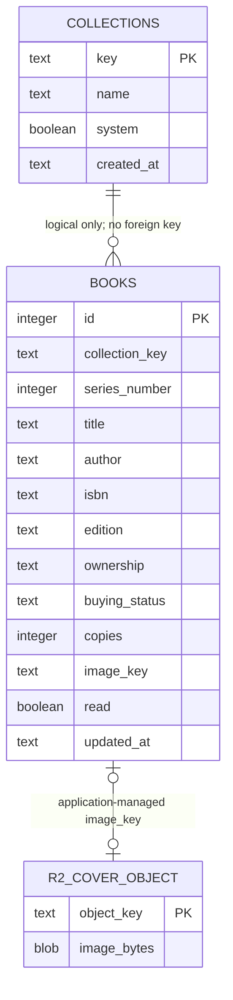

# Database

This document distinguishes verified production behavior, verified local implementation, accepted direction, and future ideas. It does not authorize production schema changes.

## Verified Production State

### Persistence

- Cloudflare D1 stores structured records.
- Cloudflare R2 stores cover image bytes.
- `localStorage` stores interface preferences only.
- Drizzle defines the schema; SQL migrations manage changes.
- The books API performs request-time schema and seed checks.

### Current tables

| Store | Table/object | Primary key | Current responsibilities |
| --- | --- | --- | --- |
| D1 | `books` | `id INTEGER PRIMARY KEY AUTOINCREMENT` | Collection membership, series number, title, author, classification, ownership, buying status, aggregate copies, edition, one ISBN, notes, guidance, one image key, read state, updated timestamp |
| D1 | `collections` | `key TEXT PRIMARY KEY` | Name, system/custom marker, created timestamp |
| R2 | Cover object | Object key | Image bytes referenced by `books.image_key` |

`books` has indexes on `collection_type` and `collection_key`, plus a unique constraint on `(collection_key, collection_type, series_number)`. Collections have no settings fields.

### Current relationships



There are no declared foreign keys. In particular, `books.collection_key` is not enforced against `collections.key`; route code currently carries collection-deletion safety.

### Current missing tables

- Purchases
- Businesses
- Book identifiers
- Book aliases or relationships
- Asset metadata
- Tags and book-tag assignments
- Review batches and proposals
- Collection settings
- Import/export history

### Primary key strategy

- Preserve the stable internal numeric `books.id` values.
- Preserve `collections.key`; it is generated once, survives rename, and remains the collection identifier.
- Current auto-increment book IDs are not portable across independent databases, so safe interchange still lacks an immutable external identifier.

### Foreign key status

No relationships are enforced by D1. The first required foreign key is:

```text
books.collection_key -> collections.key
```

Adding it requires an orphan audit, backup, controlled SQLite table rebuild, and verification that every existing book and collection identifier is unchanged.

### Mixed responsibilities

| Location | Problem |
| --- | --- |
| `books` | Combines catalog identity, bibliographic/edition data, collection state, copies, shopping, reading, guidance, notes, and cover association |
| `collections` | Not overloaded, but lacks collection-level settings such as target price and cover policy |
| `books.image_key` | Cannot distinguish personal/reference assets, variants, attribution, superseded images, or orphans |
| `books.collection_type` | Mixes classification with special-case behavior and should not become general workflow state |

The first responsibilities to move out of `books` are purchases, alternate identifiers, asset metadata, tags, and review state.

## Verified Local Implementation

The Shopping persistence/API foundation is implemented and validated in the local Site working copy. It is not saved as a Site version, migrated to production, or published.

| Table | Locally implemented change |
| --- | --- |
| `books` | Nullable `added_at`; existing unknown historical dates remain `NULL`, while newly created or imported Books receive an Added Date |
| `collections` | Nullable, non-negative `target_price_cents`; CYOA is initialized to 600 cents and other collection targets remain `NULL` |
| `businesses` | Internal auto-increment integer ID, cleaned display name, unique normalized name, and timestamps |
| `purchases` | Internal auto-increment integer ID, required Book, optional Business, independent nullable prices in integer cents, optional purchase date, controlled condition, and timestamps |

Purchase references restrict deletion of referenced Books and Businesses. Purchase creation does not derive or update Book ownership or copy counts. Local disposable migration tests verified preservation, uniqueness, checks, foreign keys, and conservative deletion behavior; production records were not inspected.

The locally implemented condition vocabulary is: New, Like New, Very Good, Good, Fair, Poor, and Unknown.

## Accepted Direction

The accepted strategy is additive migration, not a rewrite or immediate title/edition/copy hierarchy.

1. Preserve existing `books.id` and `collections.key` values.
2. Audit orphaned collection references and back up D1.
3. Add `businesses`, then `purchases`, `collections.target_price_cents`, and nullable `books.added_at`.
4. Rebuild `books` in a controlled migration to enforce `books.collection_key -> collections.key`.
5. Add `book_identifiers` before advanced scanner matching; do not create a parallel `AltBooks` table.
6. Add immutable stable IDs, revisions, format versioning, and conflict handling before safe export/import.
7. Add review batches and proposals after stable interchange exists.
8. Add asset metadata immediately before reference-cover enrichment.
9. Add tags and assignments when the Tags roadmap item begins.

Shopping persistence decisions are recorded in [ADR-0007](decisions/ADR-0007-shopping-persistence-foundation.md); identifier strategy is recorded in [ADR-0008](decisions/ADR-0008-canonical-books-and-identifiers.md).

### Recommended relationship behavior

| Relationship | Accepted migration direction |
| --- | --- |
| Collection to books | Restrict deletion |
| Book to purchases | Restrict or deliberate archival |
| Business to purchases | Set null or restrict |
| Book to identifiers | Cascade |
| Book to asset metadata | Restrict until object cleanup succeeds |
| Book to tag assignments | Cascade |
| Review batch to proposals | Cascade |
| Book to review history | Preserve rather than silently cascade |

### Shopping persistence foundation

- `businesses`: normalized business identity with an internal integer ID and unique normalized name.
- `purchases`: internal integer primary key, book, optional business, purchase/sticker prices in integer cents, date, condition, and timestamps.
- An immutable Purchase `stable_id` is deferred and is not required for the current Shopping persistence foundation.
- A portable immutable Purchase identifier is required before Import/Export, backup/restore reconciliation, or AI Review must preserve Purchase records across database boundaries.
- `collections.target_price_cents`: collection-level target price; the CYOA target is initialized to approximately 600 cents.
- `books.added_at`: nullable Added Date; preserve `NULL` when the true historical date is unknown, and set it for newly created or imported Books going forward. Historical dates must not be fabricated.
- Historical averages are calculated from purchases rather than stored as aggregates.
- Persistence and integrity precede Shopping Mode UI redesign.

## Future Ideas

These remain later possibilities rather than accepted current implementation work:

- A small `book_aliases` relationship if title aliases become necessary.
- Asset variants, checksums, dimensions, source, attribution, and lifecycle metadata.
- Versioned review interchange with changed-since-export detection.
- Collection-level cover policy and expected-series behavior, either on `collections` or in one-to-one settings.
- Full edition management only if a later requirement justifies it; it is currently out of scope.

See [Current State](CURRENT_STATE.md) for operational maturity and [Roadmap](ROADMAP.md) for sequencing.
