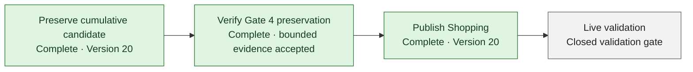

# Project Dashboard

> Concise visual planning summary derived from [Current State](CURRENT_STATE.md), [Roadmap](ROADMAP.md), [Staged Milestones](STAGED_MILESTONES.md), and [Next Actions](NEXT_ACTIONS.md). Percentages are coarse planning estimates—not validation evidence. Briefs, tests, gate reports, and Current State remain authoritative.

## Progress at a glance

| KPI | Coarse estimate | Progress | What it measures |
| --- | ---: | --- | --- |
| Core build completion | **~90%** | `██████████████████░░` | Functionality implemented and validated locally |
| Release readiness | **~85%** | `█████████████████░░░` | Preservation, production verification, publication, and live validation |
| Broader roadmap completion | **~60%** | `████████████░░░░░░░░` | Current release plus later planned product capabilities |

These estimates intentionally measure different outcomes. High local completion does not imply that the source is saved, published, production-verified, or live-validated.

## M1–M6 milestone view

| Milestone | Coarse estimate | Status | Release boundary |
| --- | ---: | --- | --- |
| M1 — Validation-environment feasibility | **100%** | Complete locally | Investigation completed; no safe runnable unpublished preview was found |
| M2 — Controlled Shopping release | **~85%** | Release-gated | Exact Version 20 published; Product Owner live validation and later smoke remain gated |
| M3 — Canonical identifiers | **100% locally** | Published; validation-gated | Included in Version 20; not independently hands-on validated |
| M4 — Bookshelf | **100% locally** | Published; validation-gated | Included in Version 20; Product Owner checkpoint remains gated |
| M5 — Export foundation | **100% locally** | Published; partial operational evidence | Included in Version 20; not a complete production backup |
| M6 — Downloadable catalog export | **100% locally** | Published; validation-gated | Included in Version 20; hands-on checkpoint remains separate |

Every milestone percentage is a coarse planning estimate. “100% locally” means the accepted local scope is implemented and validated; it never means saved, published, production-verified, or live-validated.

## Remaining release path

- **Preserve:** Complete. Exact cumulative Shopping/M3–M6/Bookshelf candidate was saved, identity-verified, and later published as Version 20.
- **Verify Gate 4:** Complete within the bridge-observable boundary; this does not prove D1 snapshot, R2-byte backup, restore readiness, or complete backup.
- **Publish Shopping:** Complete. Exact saved Version 20 published successfully once; later checkpoint `608553f` was excluded.
- **Live validation:** Requires an explicitly authorized live-only sequence because supported tooling exposes no runnable unpublished preview.

Exact queue, usage, blocker, owner, and gate state belongs in [Current State](CURRENT_STATE.md) and [Next Actions](NEXT_ACTIONS.md).

## Future work

| Capability | Status | Current boundary |
| --- | --- | --- |
| My Library visual experience | Partial | Version 21 public behavior still mismatches four markers; controlled republish stopped before tests because Node 18 did not meet the required Node 22.13+ runtime |
| Safe import and restore | Planned | Existing mutable import is insufficiently safe; no restore or round-trip workflow is authorized |
| AI review | Planned | Needs versioned interchange, proposal/review staging, and concurrency protection |
| Cover enrichment | Planned | Needs attribution, personal/reference separation, and safe identifier matching |
| Asset lifecycle | Partial | Upload/serving exists; metadata, variants, cleanup, and complete byte backup remain incomplete |
| Tags | Planned | Persistence and assignment model are absent |
| Administration and analytics | Partial | Owner administration exists for bounded operations; dedicated analysis/administration remains later scope |

These are roadmap capabilities, not fill-in tasks and not executable authority.

## Maintenance rule

Designer — Relena updates this dashboard after:

- accepting an Engineer completion report;
- changing a milestone state; or
- changing roadmap scope.

Maintenance constraints:

- Update each percentage or status in only one dashboard location.
- Derive the dashboard from authoritative project documents; do not move detailed operational state here.
- Do not calculate false precision from task counts.
- Keep feature completion distinct from release readiness.
- Never use “100% locally” to imply saved, published, production-verified, or live-validated.

## Optional future enhancement

A richer GitHub Pages KPI view may be considered later. Keep Markdown authoritative and require a separate documentation decision before adding presentation code. This dashboard intentionally introduces no JavaScript, new build system, external badge dependency, or automated percentage calculation.
