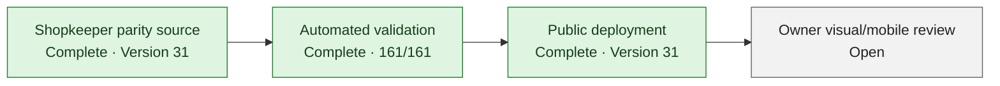

# Project Dashboard

> Concise visual planning summary derived from [Current State](CURRENT_STATE.md), [Roadmap](ROADMAP.md), [Staged Milestones](STAGED_MILESTONES.md), and [Next Actions](NEXT_ACTIONS.md). Percentages are coarse planning estimates—not validation evidence. Briefs, tests, gate reports, and Current State remain authoritative.

## Progress at a glance

| KPI | Coarse estimate | Progress | What it measures |
| --- | ---: | --- | --- |
| Core build completion | **~92%** | `██████████████████░░` | Current Library and Shopkeeper foundation implemented and validated |
| Release readiness | **~95%** | `███████████████████░` | Version 31 is public; Product Owner review remains |
| Broader roadmap completion | **~62%** | `████████████░░░░░░░░` | Current release plus later enrichment, portability, and analysis work |

These estimates intentionally measure different outcomes. High local completion does not imply that the source is saved, published, production-verified, or live-validated.

## M1–M6 milestone view

| Milestone | Coarse estimate | Status | Release boundary |
| --- | ---: | --- | --- |
| M1 — Validation-environment feasibility | **100%** | Complete locally | Investigation completed; no safe runnable unpublished preview was found |
| M2 — Controlled Shopping release | **100% locally** | Published in Version 31; owner review pending | Shopkeeper parity, compact presentation, shared resolution outcomes, and scanner recovery are deployed |
| M3 — Canonical identifiers | **100% locally** | Published | Exact/equivalent ISBN resolution remains the local-first boundary |
| M4 — Bookshelf | **100% locally** | Published; later visual work held | Category shelves remain; denser spines and missing-title presentation await visual review |
| M5 — Export foundation | **100% locally** | Published; partial operational evidence | Catalog export exists but is not a complete production backup |
| M6 — Downloadable catalog export | **100% locally** | Published | Broader restore remains a separate future milestone |

Every milestone percentage is a coarse planning estimate. “100% locally” means the accepted local scope is implemented and validated; it never means saved, published, production-verified, or live-validated.

## Remaining release path

- **Shopkeeper parity:** Complete in exact public Version 31 source `d9d83bb4c964c2de9af8c0affdcb1a44ed5e6792`.
- **Automated validation:** Complete for the release boundary: focused scanner/OCR, full application, release identity, lint, and production build checks passed.
- **Publication:** Complete with the existing public audience preserved.
- **Owner review:** Open for the compact presentation and real mobile/desktop scanner workflow.

Exact queue, usage, blocker, owner, and gate state belongs in [Current State](CURRENT_STATE.md) and [Next Actions](NEXT_ACTIONS.md).

## Future work

| Capability | Status | Current boundary |
| --- | --- | --- |
| Phase A — IA and responsive shell | Accepted from Version 24 | Preserve Library-first navigation and mobile parity |
| 1 — Reference-cover enrichment | Planned · medium-large | Needs attribution, personal/reference separation, safe identifier matching, and a confirmed cover-click source boundary |
| 2 — Asset lifecycle and complete cover backup | **NEEDS MORE INFORMATION** · medium-large | Upload/serving exists; metadata, variants, cleanup, complete byte backup, and recovery guarantees need a clarified boundary |
| 3 — Scanner/matching improvements | Substantially complete · medium | Main Library and Shopkeeper share explicit outcomes; live capture stability and future metadata breadth remain |
| 4 — Tags | Planned · medium | Persistence and assignment model are absent |
| 5 — Safe import/restore | Planned · medium-large | Existing mutable import is insufficiently safe; no restore or round-trip workflow is authorized |
| 6 — AI Review | Planned · large | Needs versioned interchange, proposal/review staging, and concurrency protection |
| 7 — Expanded administration and analysis | Partial · medium | Owner administration exists for bounded operations; dedicated analysis remains later scope |

These are roadmap capabilities, not fill-in tasks and not executable authority.

## Maintenance rule

Designer — Relena updates this dashboard after:

- accepting an Engineer completion report;
- changing a milestone state; or
- changing roadmap scope.

Maintenance constraints:

- Update each percentage or status in only one dashboard location.
- Derive the dashboard from authoritative project documents; do not move detailed operational state here.
- Do not calculate false precision from task counts.
- Keep feature completion distinct from release readiness.
- Never use “100% locally” to imply saved, published, production-verified, or live-validated.

## Optional future enhancement

A richer GitHub Pages KPI view may be considered later. Keep Markdown authoritative and require a separate documentation decision before adding presentation code. This dashboard intentionally introduces no JavaScript, new build system, external badge dependency, or automated percentage calculation.
