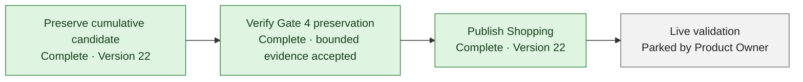

# Project Dashboard

> Concise visual planning summary derived from [Current State](CURRENT_STATE.md), [Roadmap](ROADMAP.md), [Staged Milestones](STAGED_MILESTONES.md), and [Next Actions](NEXT_ACTIONS.md). Percentages are coarse planning estimates—not validation evidence. Briefs, tests, gate reports, and Current State remain authoritative.

## Progress at a glance

| KPI | Coarse estimate | Progress | What it measures |
| --- | ---: | --- | --- |
| Core build completion | **~90%** | `██████████████████░░` | Functionality implemented and validated locally |
| Release readiness | **~90%** | `██████████████████░░` | Preservation, production verification, publication, and live validation |
| Broader roadmap completion | **~60%** | `████████████░░░░░░░░` | Current release plus later planned product capabilities |

These estimates intentionally measure different outcomes. High local completion does not imply that the source is saved, published, production-verified, or live-validated.

## M1–M6 milestone view

| Milestone | Coarse estimate | Status | Release boundary |
| --- | ---: | --- | --- |
| M1 — Validation-environment feasibility | **100%** | Complete locally | Investigation completed; no safe runnable unpublished preview was found |
| M2 — Controlled Shopping release | **~95%** | Release-gated | Carried unchanged into exact Version 22; public Shopping navigation reconfirmed, prior markers retained, and Product Owner validation/later smoke remain gated |
| M3 — Canonical identifiers | **100% locally** | Published; validation-gated | Carried unchanged into Version 22; not independently hands-on validated |
| M4 — Bookshelf | **100% locally** | Published; validation-gated | Carried unchanged into Version 22; Version 21 marker evidence retained; Product Owner checkpoint remains gated |
| M5 — Export foundation | **100% locally** | Published; partial operational evidence | Carried unchanged into Version 22; not a complete production backup |
| M6 — Downloadable catalog export | **100% locally** | Published; validation-gated | Carried unchanged into Version 22; hands-on checkpoint remains separate |

Every milestone percentage is a coarse planning estimate. “100% locally” means the accepted local scope is implemented and validated; it never means saved, published, production-verified, or live-validated.

## Remaining release path

- **Preserve:** Complete. Exact cumulative source was preserved through Version 20, the bounded correction candidate was saved and published as Version 21, and the isolated version-label delta was saved and published as exact Version 22.
- **Verify Gate 4:** Complete within the bridge-observable boundary; this does not prove D1 snapshot, R2-byte backup, restore readiness, or complete backup.
- **Publish Shopping:** Complete. Exact saved Version 22 at `a360c97679a47ce604fa712245fcc3935a649df6` is published with definitive success; Shopping feature source is unchanged from Version 21, and later checkpoint `608553f` remains excluded.
- **Live validation:** Requires an explicitly authorized live-only sequence because supported tooling exposes no runnable unpublished preview.

Exact queue, usage, blocker, owner, and gate state belongs in [Current State](CURRENT_STATE.md) and [Next Actions](NEXT_ACTIONS.md).

## Future work

| Capability | Status | Current boundary |
| --- | --- | --- |
| Phase A — IA and responsive shell | Selected next priority after capacity recovery | Mandatory visual review, current Version 22 composition/collision review, fresh estimate, bounded goal, and separate execution authority required |
| 1 — Reference-cover enrichment | Planned · medium-large | Needs attribution, personal/reference separation, safe identifier matching, and a confirmed cover-click source boundary |
| 2 — Asset lifecycle and complete cover backup | **NEEDS MORE INFORMATION** · medium-large | Upload/serving exists; metadata, variants, cleanup, complete byte backup, and recovery guarantees need a clarified boundary |
| 3 — Scanner/matching improvements | Partial · medium | Canonical identifier foundation exists; fuzzy candidate and user-facing matching remain later |
| 4 — Tags | Planned · medium | Persistence and assignment model are absent |
| 5 — Safe import/restore | Planned · medium-large | Existing mutable import is insufficiently safe; no restore or round-trip workflow is authorized |
| 6 — AI Review | Planned · large | Needs versioned interchange, proposal/review staging, and concurrency protection |
| 7 — Expanded administration and analysis | Partial · medium | Owner administration exists for bounded operations; dedicated analysis remains later scope |

These are roadmap capabilities, not fill-in tasks and not executable authority.

## Maintenance rule

Designer — Relena updates this dashboard after:

- accepting an Engineer completion report;
- changing a milestone state; or
- changing roadmap scope.

Maintenance constraints:

- Update each percentage or status in only one dashboard location.
- Derive the dashboard from authoritative project documents; do not move detailed operational state here.
- Do not calculate false precision from task counts.
- Keep feature completion distinct from release readiness.
- Never use “100% locally” to imply saved, published, production-verified, or live-validated.

## Optional future enhancement

A richer GitHub Pages KPI view may be considered later. Keep Markdown authoritative and require a separate documentation decision before adding presentation code. This dashboard intentionally introduces no JavaScript, new build system, external badge dependency, or automated percentage calculation.
